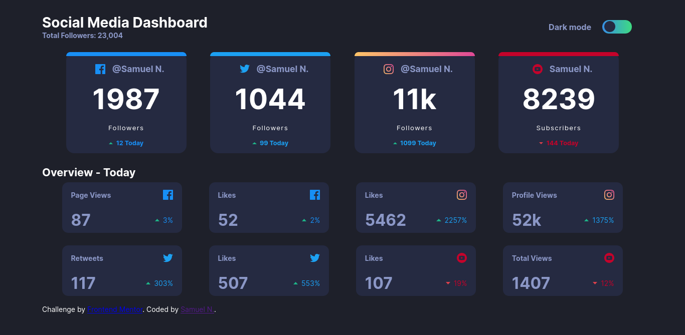

# Frontend Mentor - Social media dashboard with theme switcher solution

This is a solution to the [Social media dashboard with theme switcher challenge on Frontend Mentor](https://www.frontendmentor.io/challenges/social-media-dashboard-with-theme-switcher-6oY8ozp_H). Frontend Mentor challenges help you improve your coding skills by building realistic projects. 

## Table of contents

- [Overview](#overview)
  - [The challenge](#the-challenge)
  - [Screenshot](#screenshot)
  - [Links](#links)
- [My process](#my-process)
  - [Built with](#built-with)
  - [What I learned](#what-i-learned)
  - [Useful resources](#useful-resources)
- [Author](#author)


## Overview

### The challenge

Users should be able to:

- View the optimal layout for the site depending on their device's screen size
- See hover states for all interactive elements on the page
- Toggle color theme to their preference

### Screenshot




### Links

- Solution URL: [Github](https://github.com/SamuelNarciso/social-media-dashboard)
- Live Site URL: [GitHub-Pages](https://samuelnarciso.github.io/social-media-dashboard/)

## My process

### Built with

- Semantic HTML5 markup
- CSS custom properties
- Sass Preprocessor
- Flexbox
- media queries
- javascript 


### What I learned

I learned how to modify a checkbox with css, organized flexbox and how to do a color  change, only using scss and js

How to change colors easily with js and scss:

```scss
$white: #1e202a ;
$dark: #ffffff ;
body{
  background: $white ;
  color:$dark ;

&.dark :{
  color:$white ;
  background: $dark ;
  }
}
```
```javascript

  document.querySelector('body').classlist.toggle('dark')

```

### Useful resources

- [Css Gradient](https://cssgradient.io/) - This helped me for make instagram gradient 

- [Switch, dark mode with css and js ](https://youtu.be/2Nmi1sXu12U) - This video helped me to do switch 

## Author

- Github - [SamuelNarciso](https://github.com/SamuelNarciso)
- Frontend Mentor - [@SamuelNarciso](https://www.frontendmentor.io/profile/SamuelNarciso)
- Twitter - [@SamuelNarciso28](https://www.twitter.com/samuelnarciso28)


